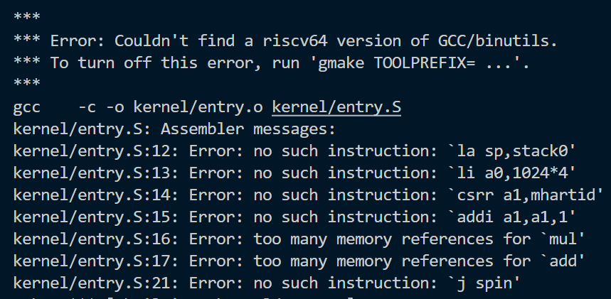
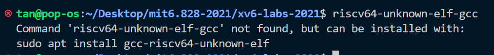
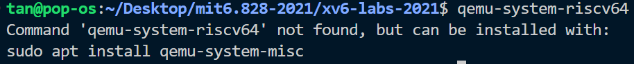
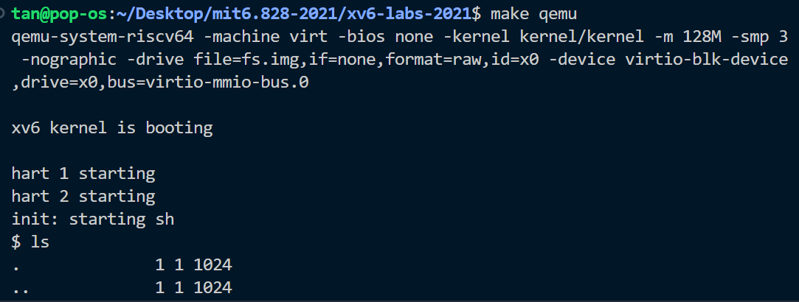
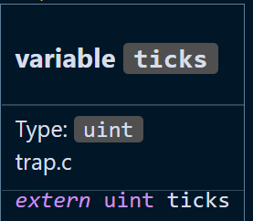
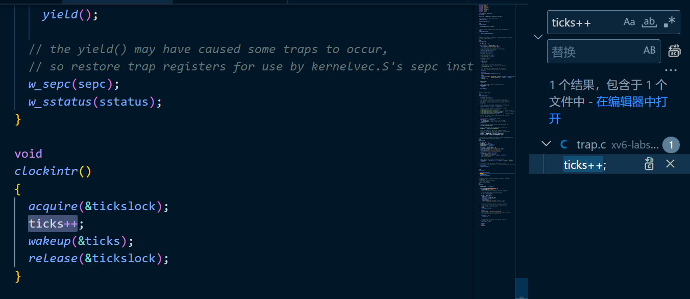
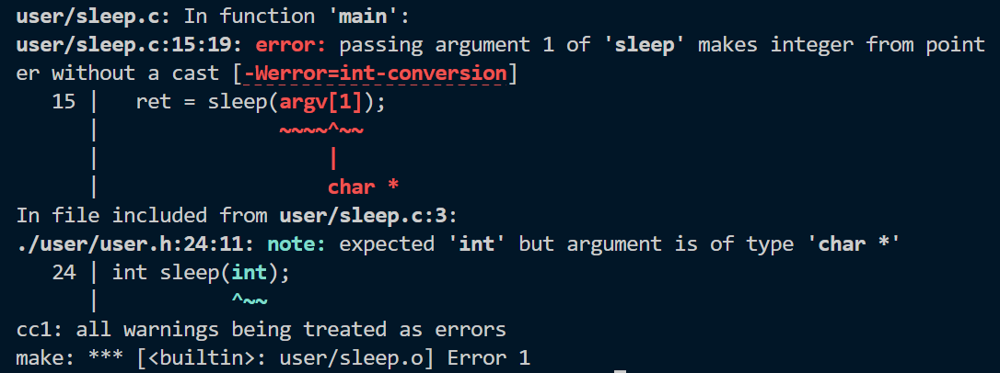
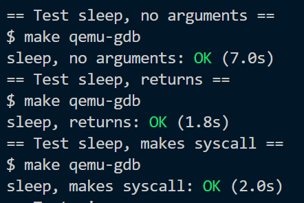
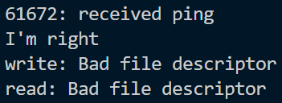
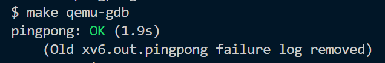

# Lab: Xv6 and Unix utilities

[lab地址](https://pdos.csail.mit.edu/6.828/2021/labs/util.html)

#### 一，下载xv6源代码，切换到util仓库

```sh
git clone git://g.csail.mit.edu/xv6-labs-2021
cd xv6-labs-2021
git checkout util
```

#### 二，编译

```sh
make qemu
```

#### 编译的时候产生问题一，编译报错


主要是汇编器的错误，说没有这些指令，原因是ISA不对，我需要RISC-V的gcc工具链，好在ubuntu可以帮我判断一些命令来自于哪些包，如下图，安装即可。



riscv64-unknown-elf-gcc是lab里写的。

#### 继续make qemu产生问题二，没找到qemu-system-riscv64


一样，让ubuntu告诉我们需要装哪个包，安装即可



#### 三，进入xv6

```sh
make qemu
```

make执行成功后就会进入xv6



想起以前boot linux kernel 的时候，下源码，编kernel，编busybox，做rootfs，qemu启动，如果要使用网络协议栈还得自己配置qemu网络，感谢MIT的老师把这些work做了，方便学生。

#### 四，在刚刚boot的xv6中实现sleep（easy）

> Implement the UNIX program `sleep` for xv6; your `sleep` should pause for a user-specified number of ticks. A tick is a notion of time defined by the xv6 kernel, namely the time between two interrupts from the timer chip. Your solution should be in the file `user/sleep.c`.

时间对于计算机来说是一件很复杂的事情，好在我需要实现的不是绝对时间（时分秒毫秒之类的），而是tick，即两个定时器中断的interval间隔。

> Use the system call `sleep`.

正当我想着去哪找timer中断处理程序给里面加个全局counter的时候，看到了这句话，发现自己需要写的是用户态程序，代码类似于glibc，包装系统调用即可，来看看syscall的实现。

```c
// kernel/sysproc.c
uint64 sys_sleep(void) {
  int n;
  uint ticks0;

  if(argint(0, &n) < 0)
    return -1;
  acquire(&tickslock);
  ticks0 = ticks;
  while(ticks - ticks0 < n) {
    if(myproc()->killed){
      release(&tickslock);
      return -1;
    }
    sleep(&ticks, &tickslock);
  }
  release(&tickslock);
  return 0;
}
// user/user.h
int sleep(int);
```

首先注意到ticks这个变量（因为它不是局部变量），vscode告诉我他是定义在trap.c的extern unit全局变量，一看到trap让我情不自禁想起中断处理程序，于是大胆猜测这是上文提到的counter变量，如果它真的是个counter，全局搜索ticks++说不定能找到timer中断的处理函数（除非他写的是ticks = ticks + 1）。





找到了，基本上是石锤ticks代表系统开机后经过了多少次timer中断，回头看sys_sleep函数就很简单了。

- ticks0记录了调用sleep的时候ticks的值。
- 然后不断检查是否超时，未超时继续sleep，超时就返回（睡够了）。

值得注意的是，sys_sleep没有参数，而sleep系统调用是有参数的，不难看出这个n是sleep系统调用的参数。

还没完，sys_sleep调用了一个叫sleep的函数，挺好奇这个函数在做什么，他会不会跑很久导致sys_sleep无法及时退出? 为什么要while循环反复掉sleep，只调一次不行吗？（自行思考）

```c
// kernel/proc.c
void sleep(void *chan, struct spinlock *lk) {
  struct proc *p = myproc();
 
  acquire(&p->lock);
  release(lk);

  // Go to sleep.
  p->chan = chan;
  p->state = SLEEPING;

  sched();

  // Tidy up.
  p->chan = 0;

  // Reacquire original lock.
  release(&p->lock);
  acquire(lk);
}
```

首先，这个叫 proc（process）的结构体肯定代表一个进程，类似于task_struct。

这个文件叫 proc.c，这个结构体也叫proc，proc 结构体的定义不是在proc.c就是在proc.h里。

我们需要知道proc结构体的一些字段的含义

- p -> chan	？
- p -> state	进程状态，应该都学过。
- p -> lock	锁，不重要。

myproc乍一看很像Linux里的current，代表当前正在（该cpu上）运行的进程，暂时不管他。

sched函数的注释（位于proc.c）告诉我们它是（切换到）调度程序，猜里面可能调用类似switch、switch_to等用于处理上下文切换的函数。

现在的问题是chan是什么意思，根据代码我们至少知道以下信息

- chan是用来描述一个进程的东西
- chan可以被设置成系统开机后经过的timer中断数
- chan需要在调度程序运行后清零（NULL）
- 它的类型是void *说明传入的参数类型变化比较大

想不出，翻了翻proc的定义，还是不知道chan是什么

```c
void *chan;		// If non-zero, sleeping on chan
```

#### 网上冲浪一，chan是什么意思

Google关键字，xv6 proc struct chan meaning

找到[6.828的手册](https://pdos.csail.mit.edu/6.828/2022/xv6/book-riscv-rev3.pdf)，搜索 chan 

> Here’s a step in that direction, though as we will see it is not enough. Let’s imagine a pair of calls, sleep and wakeup, that work as follows. sleep(chan) sleeps on the arbitrary value **chan**, **called the wait channel**. sleep puts the calling process to sleep, releasing the CPU for other work. wakeup(chan) wakes all processes sleeping on chan (if any), causing their sleep calls to return. If no processes are waiting on chan, wakeup does nothing. We can change the semaphore implementation to use sleep and wakeup (changes highlighted in yellow):

确认chan代表wait channel，这部分提到了wakeup函数

```c
// kernel/proc.c
// Wake up all processes sleeping on chan.
void wakeup(void *chan) {
  struct proc *p;

  for(p = proc; p < &proc[NPROC]; p++) {
    if(p != myproc()){
      acquire(&p->lock);
      if(p->state == SLEEPING && p->chan == chan) {
        p->state = RUNNABLE;
      }
      release(&p->lock);
    }
  }
}
```

注意 p->chan == chan 比对指针，这里基本确认chan这个字段是用来区别sleep中的进程的，wakeup可以一次性唤醒同一个chan下的所有SLEEPING进程。

#### 网上冲浪一结束

现在基本知道chan是做什么的了，进程sleep通常是在等待某一条件被满足，chan唯一标识这些条件。

注意到在调用完sched后进程要想被再次调度，执行sched函数以后的内容（把chan设置为NULL等），进程状态必须是RUNNABLE。

那么谁负责将进程改为RUNNABLE，[6.828的手册](https://pdos.csail.mit.edu/6.828/2022/xv6/book-riscv-rev3.pdf)给出了答案。

>  sleep puts the calling process to sleep, releasing the CPU for other work. **wakeup**(chan) wakes all processes sleeping on chan (if any), causing their sleep calls to return.

答案是上文提到的wakeup，那么谁调用的wakeup呢，是 *clockintr* 定时器中断处理函数。

```c
void clockintr() {
  acquire(&tickslock);
  ticks++;
  wakeup(&ticks);
  release(&tickslock);
}
```

#### 五，我们（早就）可以开始写用户态的sleep.c了

sleep的核心内容全在上面的分析中了，下面的代码只是调用一下syscall而已。

```c
#include "kernel/types.h"
#include "kernel/stat.h"
#include "user/user.h"

int
main(int argc, char *argv[])
{
  int ret;

  if(argc < 2) {
    fprintf(2, "Usage: sleep [ticks]\n");
    exit(1);
  }

  ret = sleep(argv[1]);

  if(ret == -1) {
    fprintf(2, "kernel error\n");
    exit(1);
  }

  exit(0);
}
```

去 Makefile里面添加一下这个程序

```makefile
UPROGS=\
	...
	$U/_sleep\
```

编译报错，犯了个小错误，没有把字符串转为数字



按照提示，转换一下即可

> The command-line argument is passed as a string; you can convert it to an integer using `atoi` (see user/ulib.c).

修改一行即可

```c
ret = sleep(atoi(argv[1]));
```

跑**make grade**，应该没问题。



#### 六，pingpong，利用管道进行进程间通信

欸，我感觉lab1好像全是system programming的内容，都是利用syscall编写用户程序，往下翻了翻还真是 - -。

> Write a program that uses UNIX system calls to ''ping-pong'' a byte between two processes over a pair of pipes, one for each direction. The parent should send a byte to the child; the child should print "<pid>: received ping", where <pid> is its process ID, write the byte on the pipe to the parent, and exit; the parent should read the byte from the child, print "<pid>: received pong", and exit. Your solution should be in the file `user/pingpong.c`.

偷个懒，下面是一个的Linux pingpong 程序，我们把它改成xv6的样子就好咯😊

```c
#include <stdio.h>
#include <stdlib.h>
#include <sys/wait.h>
#include <unistd.h>

int main(void) {
  int fd[2]; // pipes
  pid_t pid; // process ID

  // create pipes
  if (pipe(fd) == -1) {
    perror("pipe");
    return EXIT_FAILURE;
  }

  // create child process
  pid = fork();
  if (pid == -1) {
    perror("fork");
    return EXIT_FAILURE;
  }

  if (pid == 0) { // child process
    // close write end of pipe
    close(fd[1]); // read byte from parent
    char byte;
    if (read(fd[0], &byte, 1) == -1) {
      perror("read");
      return EXIT_FAILURE;
    }

    // print received message and process ID
    printf("%d: received ping\n", getpid());

    // send byte back to parent
    if (write(fd[0], &byte, 1) == -1) {
      perror("write");
      return EXIT_FAILURE;
    }

    // close read end of pipe
    close(fd[0]);

    // exit child process
    return EXIT_SUCCESS;
  } else { // parent process
    // close read end of pipe
    close(fd[0]);
    // send byte to child
    char byte = 'a';
    if (write(fd[1], &byte, 1) == -1) {
      perror("write");
      return EXIT_FAILURE;
    }

    // wait for child to complete
    int status;
    if (wait(&status) == -1) {
      perror("wait");
      return EXIT_FAILURE;
    }

    // read byte from child
    if (read(fd[1], &byte, 1) == -1) {
      perror("read");
      return EXIT_FAILURE;
    }

    // print received message and process ID
    printf("%d: received pong\n", getpid());

    // close write end of pipe
    close(fd[1]);

    // exit parent process
    return EXIT_SUCCESS;
  }
}
```

首先，这个程序跑起来会报错😒，"I'm right"是用来判断错误是来自哪个read或write，我平时pipe写的不多，所以我上StackOverflow看了看（其实我猜到了可能是读写close的fd，像socket一样）。



#### 网上冲浪二，Bad file descriptor

google关键字，bad file descriptor，找到一个[帖子](https://stackoverflow.com/questions/11258781/bad-file-descriptor-with-linux-socket-write-bad-file-descriptor-c)。

> In general, when "Bad File Descriptor" is encountered, it means that the socket file descriptor you passed into the API is not valid, which has multiple possible reasons:
>
> 1. The fd is already closed somewhere.
> 2. The fd has a wrong value, which is inconsistent with the value obtained from socket() api

#### 网上冲浪二结束

知道大概率是读写了已经close的fd，那我就越看这两行越不顺眼，把它们删掉就正常了。

```c
close(fd[1]); // read byte from parent

// close read end of pipe
close(fd[0]);
```

#### 七，又是做移植工作的一天，把改好的pingpong移植到xv6实验环境

移植的话首先要明白我们有什么依赖（dependences），只需要把 #include 都删掉就知道了。

在上述程序中，我们使用了

- pipe，close，wait
- fork、pid_t、getpid
- read，write
- printf，perror，和一堆预定义返回值宏

然后就是给所有的 dependences 找 alternatives 咯，完整最后代码如下。

```c
#include "kernel/types.h"
#include "kernel/stat.h"
#include "user/user.h"

#define EXIT_FAILURE -1
#define EXIT_SUCCESS 0

int main(void) {
  int fd[2]; // pipes
  int pid; // process ID

  // create pipes
  if (pipe(fd) == -1) {
    fprintf(2, "pipe error");
    return EXIT_FAILURE;
  }

  // create child process
  pid = fork();
  if (pid == -1) {
    fprintf(2, "fork error");
    return EXIT_FAILURE;
  }

  if (pid == 0) { // child process
    // close write end of pipe
    char byte = 'i';
    if (read(fd[0], &byte, 1) == -1) {
      fprintf(2, "read fd[0] error");
      return EXIT_FAILURE;
    }

    // print received message and process ID
    printf("%d: received ping\n", getpid());

    // send byte back to parent
    if (write(fd[1], &byte, 1) == -1) {
      fprintf(2, "write fd[1] error");
      return EXIT_FAILURE;
    }

    // close read end of pipe
    close(fd[0]);

    // exit child process
    return EXIT_SUCCESS;
  } else { // parent process
    // close read end of pipe
    // close(fd[0]);
    // send byte to child
    char byte = 'o';
    if (write(fd[1], &byte, 1) == -1) {
      fprintf(2, "write fd[1] error");
      return EXIT_FAILURE;
    }

    // wait for child to complete
    int status;
    if (wait(&status) == -1) {
      fprintf(2, "wait error");
      return EXIT_FAILURE;
    }

    // read byte from child
    if (read(fd[0], &byte, 1) == -1) {
      fprintf(2, "read fd[0] error");
      return EXIT_FAILURE;
    }

    // print received message and process ID
    printf("%d: received pong\n", getpid());

    // close write end of pipe
    close(fd[1]);

    // exit parent process
    return EXIT_SUCCESS;
  }
  exit(EXIT_SUCCESS);
}
```

跑make grade，应该没啥问题。



#### 八，Primes

> Write a **concurrent** version of prime sieve using pipes. This idea is due to Doug McIlroy, inventor of Unix pipes. The picture halfway down [this page](http://swtch.com/~rsc/thread/) and the surrounding text explain how to do it. Your solution should be in the file `user/primes.c`.


从这题开始，我发现对pipe没理解是真的没办法做下去，特别需要注意dup操作的一些行为。来看man dup

> ​                   The  dup() system call creates a copy of the file descriptor oldfd, **using the lowest-num‐bered unused file descriptor for the new descriptor**.

重点是当前最小的没有使用的号码，如果你把当前进程的stdin（0）或 stdout（1）关闭了，然后调用dup(fd)那么新复制出来的fd就会是0或1，也就是说往0或1读写与往fd读写是一样的，即标准输入输出重定向成管道的输入输出。

如果不使用stdin和stdout重定向pipe，fd的管理（释放）会非常复杂，递归的代码也难以编写，本来这方法效率就不咋地，题目也说是concurrent 而不是parallel，

思路如下

- 每次读取管道，第一个数永远是素数（invariant），后面的数都根据这个素数来筛除。
- 筛除后保证invariant第一个是素数，然后重复上述步骤，把所有素数打印出来。

```c
#include "kernel/types.h"
#include "user/user.h"

void source() {
  int i;
  for (i = 2; i < 36; i++) {
    write(1, &i, sizeof(i));
  }
}

void cull(int p) {
  int n;
  while (read(0, &n, sizeof(n))) {
    if (n % p != 0) {
      write(1, &n, sizeof(n));
    }
  }
}

void redirect(int k, int pd[]) {
  close(k);
  dup(pd[k]);
  close(pd[0]);
  close(pd[1]);
}

void sink() {
  int pd[2];
  int p;

  if (read(0, &p, sizeof(p))) {
    printf("prime %d\n", p);
    pipe(pd);
    if (fork()) {
      redirect(0, pd);
      sink();
    } else {
      redirect(1, pd);
      cull(p);
    }
  }
}

int main(int argc, char *argv[]) {

  int pd[2];
  pipe(pd);

  if (fork()) {
    redirect(0, pd);
    sink();
  } else {
    redirect(1, pd);
    source();
  }

  exit();
}
```

